<h1>
     
    Hi there, it's Shen Yien
    
</h1>

- 🇲🇾 I'm a **Fullstack Developer** from Malaysia
- 🤓 Enjoys learning different programming stuffs (Currently Golang)
- 🏃‍♂️ Shifted from Laravel + Vue to Next.js recently
- 📙 I'm reading a book monthly, check out what I'm reading [here](https://shenyien.cyou/readings/)
- ✍ I write technical articles and sometimes [random stuffs](https://blogs.shenyien.cyou/series/life-beyond-codes) on my [blog](https://blogs.shenyien.cyou)
- 🧼 Big fan of Clean Codes, Test-Driven Development and Refactoring
- 🙅‍♂️ Dislikes dynamic language for development (e.g., Python & Vanilla JavaScript)
- ⛵ Advocates free and open source software 
- 💻 Been coding for 4 years
- 🍵 Not your typical guy who enjoys coffee, I prefer tea
- 🎧 I'm probably coding, reading, writing, driving, or studying if I'm on Spotify

## ✏️ Recent Articles from my [Blog](https://blogs.shenyien.cyou)

<!-- HASHNODE_BLOG:START -->

<a href="https://blogs.shenyien.cyou/dotenv-vault-the-new-way-to-manage-env" title="Dotenv-vault: The New Way to Manage .env"><strong>Dotenv-vault: The New Way to Manage .env</strong></a>
 <strong>23 May 2023</strong>
 

<a href="https://blogs.shenyien.cyou/the-nextjs-13-app-directory-and-server-components" title="The Next.js 13 App Directory and Server Components: What You Need to Know"><strong>The Next.js 13 App Directory and Server Components: What You Need to Know</strong></a>
 <strong>13 May 2023</strong>
 

<a href="https://blogs.shenyien.cyou/insta-next-sweatless-react-state-management-with-zustand" title="Insta-Next: Sweatless React State Management with Zustand"><strong>Insta-Next: Sweatless React State Management with Zustand</strong></a>
 <strong>24 Apr 2023</strong>
 

<a href="https://blogs.shenyien.cyou/breaking-into-the-software-industry-as-a-data-analysis-student" title="Breaking into the Software Industry as a Data Analysis Student"><strong>Breaking into the Software Industry as a Data Analysis Student</strong></a>
 <strong>21 Apr 2023</strong>
 
<!-- HASHNODE_BLOG:END -->

## 💻 Tech stack

- 🔥 Actively developing in  &  
- 😎 Used to work with  &  
- 😍 Loves  
- ⌨ Uses  for Data Science, Automation & Leetcode
- 🤓 Learning  &  to expand my backend toolset
- 📱 Used  &  to develop Android apps before
- 🧐 Super interested in  & , learning whenever I'm free
- 🐱‍🐉 The list goes on, but I don't develop actively in those anymore

## 🤝 Connect with me

    
<h2>📊 Random GitHub Stats</h2>

    
    
    
    
        
    
    
    
    

    

        
    

    

## 🎲 Some Cool Stuffs

<h3>My Leetcode Stats </h3>

### Here's a snake eating my commits

<picture>
  <source media="(prefers-color-scheme: dark)" srcset="./res/github-snake-grid-dark.svg">
  
</picture>

